# Forecasting Supply Chain Disruptions and Reducing Costs Through Data Science
**Senior Data Science Capstone, Belmont University**  
**Kayla Ahrndt**

This author is a senior Data Science major at Belmont University, completing this project as a graduation requirement for the program. 

The author's intention of this project was to learn something completely new and out of their comfort zone, to learn how to apply what they've learned in a completely unseen and unknown context, and to learn new modeling techniques. 

The author can be reached through the following email: kayla.ahrndt@gmail.com

01/2025 - 05/2025

---

## Table of Contents
- [Overview](#overview)
- [Dataset Description](#dataset-description)
- [Objectives](#objectives)
- [Feature Dictionary](#feature-dictionary)
- [Methodology](#methodology)
- [Conclusion & Next Steps](#conclusion--next-steps)

## Advanced Topics
- Interactive Visualization, 0.5 point (x7)
- Feature Engineering, 0.5 point (x1)
- Cross Validation, 0.5 point (x1)
- Gradient Boosting, 1 point (x2)
- Gaussian Process Regression, 2 points (x2)
- K-Nearest Neighbors, 1 point (x1)

---

## Overview

This project investigates international supply chain pricing for HIV/ARV medications and shipment performance using a robust dataset of pharmaceutical and medical product logistics. I applied advanced machine learning and optimization techniques to explore patterns in cost, demand, and delivery reliability.

---

## Dataset Description

The dataset consists of detailed logistics and transactional records of international shipments. Each row represents a line item in a shipment order, containing pricing, vendor, shipment method, and scheduling information.

---

## Objectives

- Identify pricing trends and forecast future unit costs  
- Improve supply chain efficiency and predict bottlenecks  
- Estimate demand and quantity trends per region and item  
- Minimize overall shipping costs using optimization models  
- Detect anomalies in pricing or delivery patterns  
- Evaluate vulnerability to disruptions and vendor inconsistency  

---

## Feature Dictionary

| Feature | Description |
|--------|-------------|
| `id` | Unique identifier |
| `project code`, `pq #`, `po / so #`, `asn/dn #` | Procurement and shipment identifiers |
| `country` | Destination country |
| `managed by`, `fulfill via`, `vendor inco term` | Logistics management and shipping terms |
| `shipment mode` | Air / Sea / Land, etc. |
| `pq first sent to client date`, `po sent to vendor date`, `scheduled delivery date`, `delivered to client date`, `delivery recorded date` | Time stamps of the procurement and delivery process |
| `product group`, `sub classification` | Product category and sub-category |
| `vendor` | Supplier or manufacturer |
| `item description`, `molecule/test type`, `brand`, `dosage`, `dosage form` | Pharmaceutical metadata |
| `unit of measure (per pack)`, `line item quantity` | Quantities shipped |
| `line item value`, `pack price`, `unit price` | Price details |
| `manufacturing site`, `first line designation` | Origin and priority flags |
| `weight (kilograms)` | Physical shipment weight |
| `freight cost (usd)`, `line item insurance (usd)` | Cost of shipping and insurance |
| `lead_time` | Days between order and delivery |

---

## Methodology

### Data Exploration & Cleaning
- Learned supply chain vocabulary, structure, relationships, and about the specific features in this dataset
- Cleaned self-referential values and values that were simultaneously noisy & unnecessary
- Standardized, enforced datetime format, created 'lead_time' column, added time-based features ('year', 'month', 'quarter')
- Created choropleths for 'Total Shipment Freight Weight (Kilograms) by Country' and 'Total Shipment Freight Cost (USD) by Country'

It makes sense for these graphs to look the same at first glance, as intuitively, more money spent on a country likely means that they receive a greater amount of product which likely totals to a greater weight sent to a country.

- Created a pairwise graph to examine the relationships between 'lead_time', 'weight (kilograms)', and 'freight cost (usd)'

We tend to see trends clustering per feature relationship, which shows us a lot of consistency (and potentially correlation) in the feature's relationships with one another.

- Created an interactive 3D scatterplot to visualize the relationships between'lead_time', 'weight (kilograms)', and 'freight cost (usd)', colored by 'shipment mode'

We see how few 'air charter' values there are and begin to better see the groupings between 'air' and 'ocean' shipment methods, where there is a vast greater number of 'air' that also tend to have a much greater spread than the more clustered 'ocean' values.

- Did Principal Component Analysis for shipment features colored by the categorical frequency that shipments are delivered to a country ('high volume', 'medium volume', 'low volume')

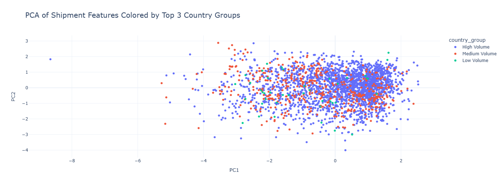

### What are the most important features that influence lead time? (Gradient Boosting Regression)

Attempt 1:
- Harnessed feature engineering and preprocessing
- Used Gradient Boosting, Random Forest, and SVR regressors
- Cross-validated
- Performed hyperparameter tuning
- Used One-Hot-Encoding

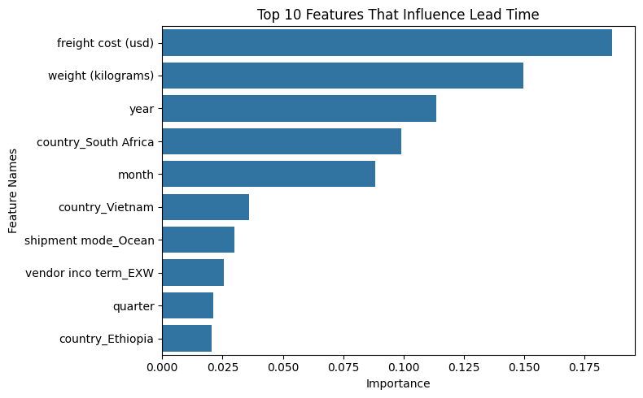
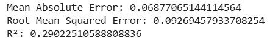

Where some of the evaluation metrics such as MAE and RMSE are considered good (close to 0), the R^2 value shows us that the model isn't doing a good job at accounting for varience (far from 1). 
This isn't a particularly reliable model, so I tried again!

Attempt 2:
- Grid Search CV

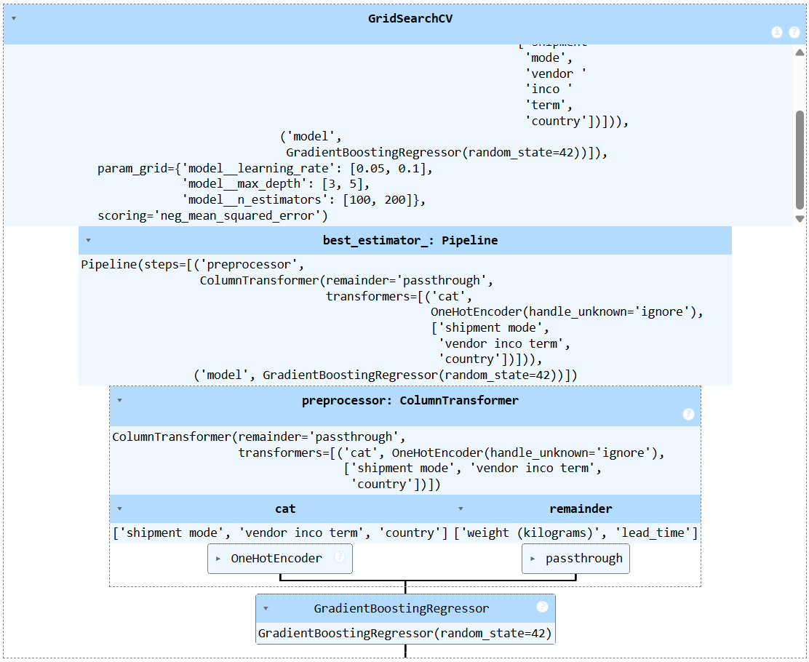
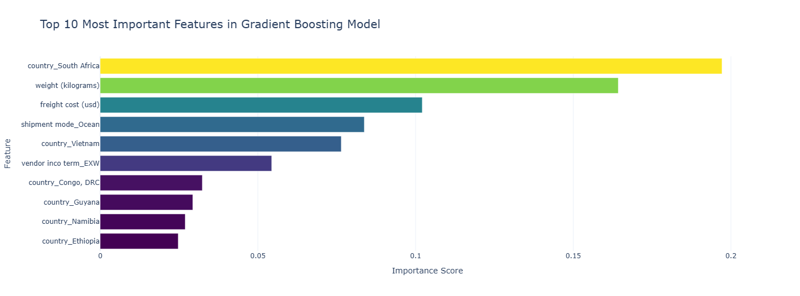
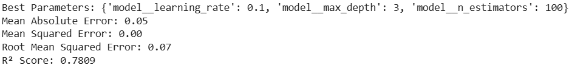

Using Grid Search CV vastly improved the performance of my model, where my MAE, MSE, and RMSE are all incredibly close to 0 and my R^2 value shot up to 0.78, which is about (and perhaps a little better than) industry standard!

### How do ARV and HIV lab commodity prices vary across countries and over time? (Time Series)

- For seasonality and external regressors - Detected seasonal pricing patterns external regressors (likely linked to geopolitics and/or shipping conditions)

Attempt 1:
- Applied ARIMA and Exponential Smoothing to forecast future price trajectories

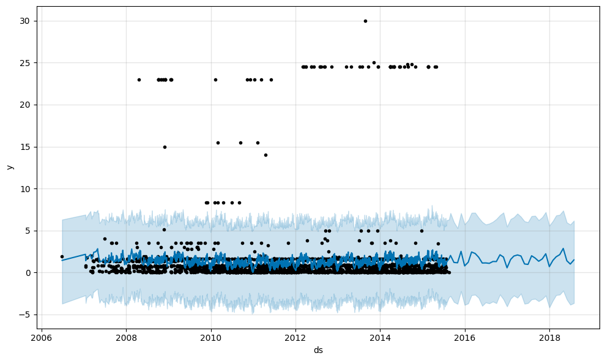

ARIMA accounts for past trends; so if prices were increasing before, it projects a continued increase. This doesn't handle external factors such as inflation or policy changes.

Attempt 2:
- Melted the pivoted DataFrame for long-format compatibility
- Visualized trends in unit price over time by country
- Visualized cleaner and easier to read

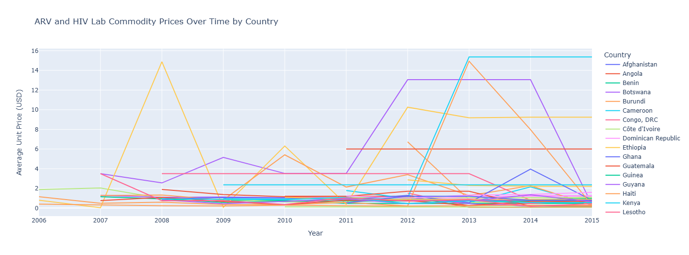

This visualization better shows (rising/lowering) trend over time, but does not account for future potential values. We can see more clearly here that, for instance prices drop in Q1 every year, but also doesn't handle external factors such as inflation or policy changes.

### How can we optimize the supply chain expenses to reduce overall costs while maintaining efficient delivery? (Optimization Algorithm)

Attempt 1:
- Created cost vector as freight cost per shipment
- Created both maximum/minimum constraints ('weight (kilometers)', 'lead_time') and bounds for decision variables (each shipment is 0 (not selected) to 1 (selected fractionally))
- Solved using linear programming

Attempt 2:
- Same as Attempt 1, but combined restraints

### Can we identify unusual patterns or outliers in pricing or shipment data that may indicate issues in the supply chain? (Gaussian Process Regression, K-Nearest Neighbors)

Gaussian Process Attempt 1:
- Preprocessed and defined Gaussian Process with RBF kernel
- Fit and predict on test data specifically with standard deviation: The optimal value found for dimension 0 of parameter k2__length_scale was close to the specified lower bound 0.01.
- Computed residuals

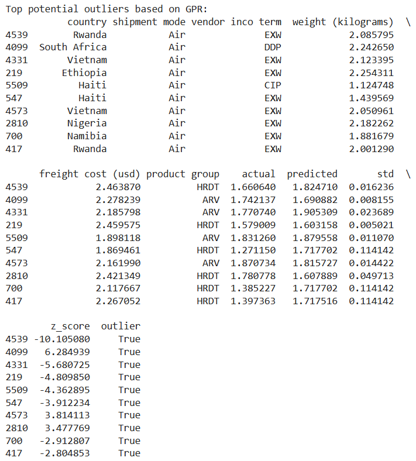
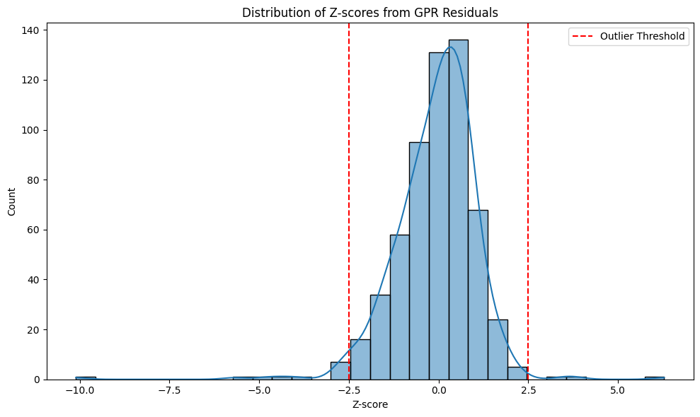
Extremely low standard deviations = overconfidence. Some predictions have repeated uncertainly values/standard deviations. Unrealistically large z-scores.

Gaussian Process Attempt 2:
- Same as attempt 1, but decreased the bound and called fit again to find a better value
- Identified outliers: where |z| > threshold

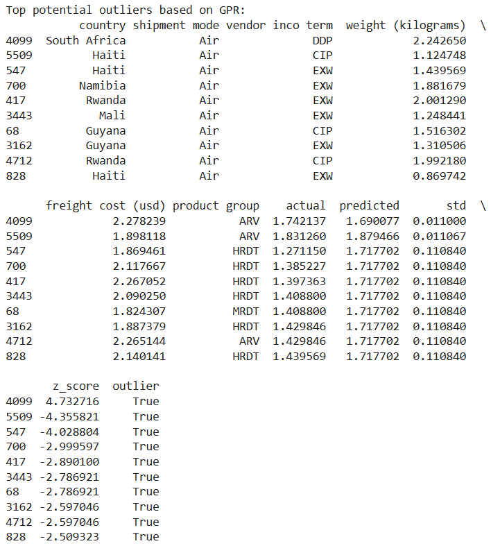
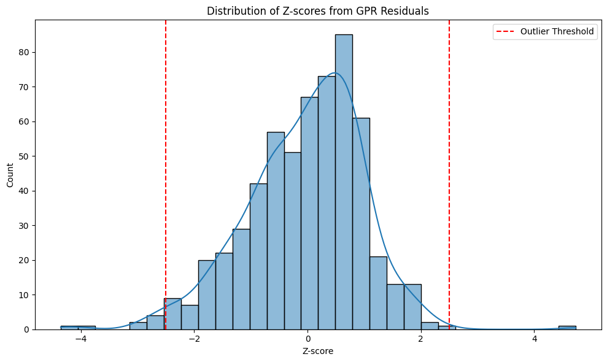
Identical predictions and standard deviations = overfitting. Standard deviations too small / similar. When different rows yield the same output, the model is likely not differentiating features well, which could stem from over-simplified encoding, feature collinearity, pipeline errors, or an inappropriate kernel setup that “flattens” the response surface. Z-score thresholds "catching" everything.

K-Nearest Neighbors
- Calculated distances to the classic 5 neighbors
- Set threshold for 95th percentile of distances

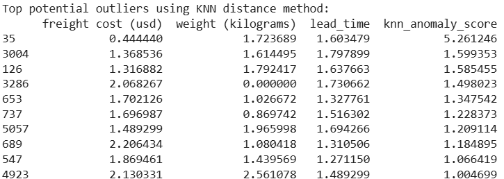
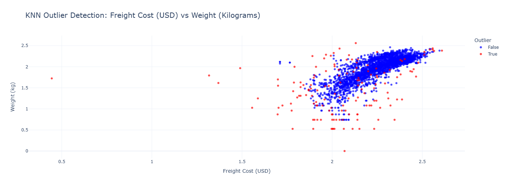

Pricing, weight, or lead time irregularities that deviate from the typical supply chain pattern. Each deviation is a shipment identifiable by ID (2-4 digit number on left).
35: Extreme deviation from local neighborhood, likely due to very low freight cost (0.44 USD) for a normal weight. Perhaps a data entry error or an underpriced shipment.
3004, 126, 3286: Moderate deviation from local neighborhood, ikely low weight or atypical combinations of weight, freight, and lead time. 
653, 737, 5057, 689, 547, 4923: Likley represent uncommon but valid shipments, or inconsistencies that deserve attention (eg, relatively high freight for low weights).

---

## Conclusion & Next Steps

This project has revealed insights into cost drivers, shipment reliability, and procurement trends. The modeling pipeline offers the potential for a blueprint of  proactive supply chain management and decision-making.

### Future Work:
- Integrate real-time logistics feeds and external factors 
- Explore carbon cost per shipment for sustainability assessments
- Build an interactive dashboard for operational use

---

