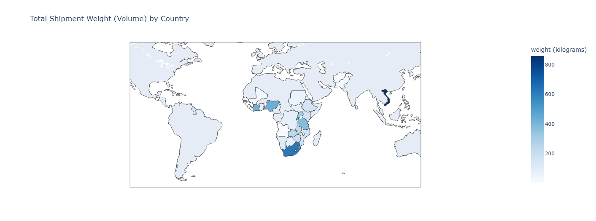
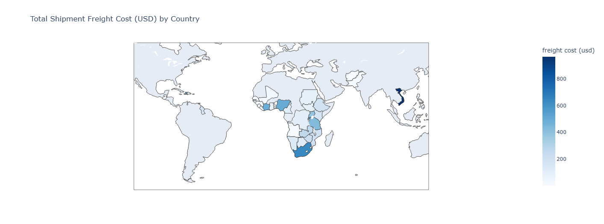
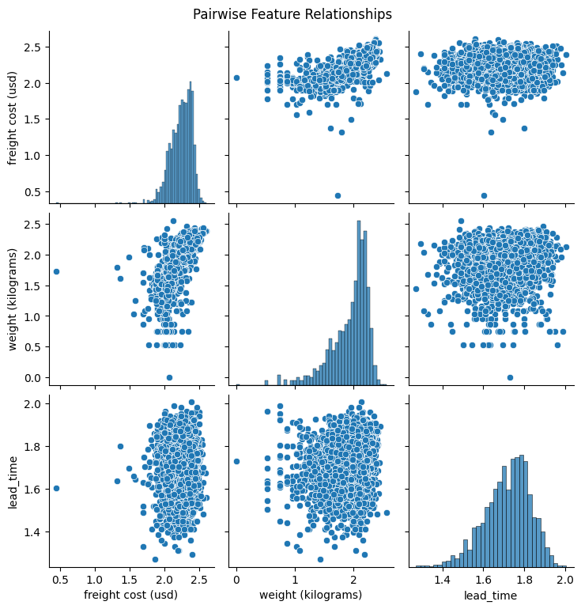
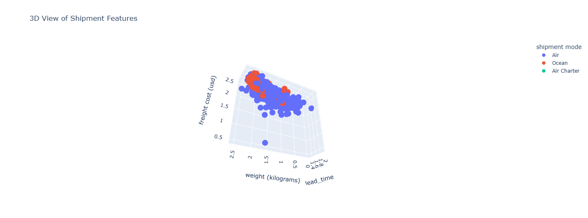

# Forecasting Supply Chain Disruptions and Reducing Costs Through Data Science
**Senior Data Science Capstone, Belmont University**  
**Kayla Ahrndt**

This author is a senior Data Science major at Belmont University, completing this project as a graduation requirement for the program. 

The author's intention of this project was to learn something completely new and out of their comfort zone, to learn how to apply what they've learned in a completely unseen and unknown context, and to learn new modeling techniques. 

The author can be reached through the following email: kayla.ahrndt@gmail.com

01/2025 - 05/2025

---

## Table of Contents
- [Overview](#overview)
- [Dataset Description](#dataset-description)
- [Objectives](#objectives)
- [Feature Dictionary](#feature-dictionary)
- [Methodology](#methodology)
  - [1. Price Analysis & Forecasting (Time Series)](#1-price-analysis--forecasting-time-series)
  - [2. Supply Chain Efficiency (Gradient Boosting)](#2-supply-chain-efficiency-gradient-boosting)
  - [3. Demand Forecasting (Support Vector Machine)](#3-demand-forecasting-support-vector-machine)
  - [4. Cost Optimization (Optimization Algorithms)](#4-cost-optimization-optimization-algorithms)
  - [5. Anomaly Detection (K-Nearest Neighbors)](#5-anomaly-detection-k-nearest-neighbors)
  - [6. Disruption Modeling (Random Forest)](#6-disruption-modeling-random-forest)
- [Conclusion & Next Steps](#conclusion--next-steps)

---

## Overview

This project investigates international supply chain pricing for HIV/ARV medications and shipment performance using a robust dataset of pharmaceutical and medical product logistics. I applied advanced machine learning and optimization techniques to explore patterns in cost, demand, and delivery reliability.

---

## Dataset Description

The dataset consists of detailed logistics and transactional records of international shipments. Each row represents a line item in a shipment order, containing pricing, vendor, shipment method, and scheduling information.

---

## Objectives

- Identify pricing trends and forecast future unit costs  
- Improve supply chain efficiency and predict bottlenecks  
- Estimate demand and quantity trends per region and item  
- Minimize overall shipping costs using optimization models  
- Detect anomalies in pricing or delivery patterns  
- Evaluate vulnerability to disruptions and vendor inconsistency  

---

## Feature Dictionary

| Feature | Description |
|--------|-------------|
| `id` | Unique identifier |
| `project code`, `pq #`, `po / so #`, `asn/dn #` | Procurement and shipment identifiers |
| `country` | Destination country |
| `managed by`, `fulfill via`, `vendor inco term` | Logistics management and shipping terms |
| `shipment mode` | Air / Sea / Land, etc. |
| `pq first sent to client date`, `po sent to vendor date`, `scheduled delivery date`, `delivered to client date`, `delivery recorded date` | Time stamps of the procurement and delivery process |
| `product group`, `sub classification` | Product category and sub-category |
| `vendor` | Supplier or manufacturer |
| `item description`, `molecule/test type`, `brand`, `dosage`, `dosage form` | Pharmaceutical metadata |
| `unit of measure (per pack)`, `line item quantity` | Quantities shipped |
| `line item value`, `pack price`, `unit price` | Price details |
| `manufacturing site`, `first line designation` | Origin and priority flags |
| `weight (kilograms)` | Physical shipment weight |
| `freight cost (usd)`, `line item insurance (usd)` | Cost of shipping and insurance |
| `lead_time` | Days between order and delivery |

---

## Methodology

### 1. Data Exploration & Cleaning
- Learned supply chain vocabulary, structure, relationships, and about the specific features in this dataset
- Cleaned self-referential values and values that were simultaneously noisy & unnecessary
- Standardized, enforced datetime format, created 'lead_time' column, added time-based features ('year', 'month', 'quarter')
- Created choropleths for 'Total Shipment Freight Weight (Kilograms) by Country' and 'Total Shipment Freight Cost (USD) by Country'

It makes sense for these graphs to look the same at first glance, as intuitively, more money spent on a country likely means that they receive a greater amount of product which likely totals to a greater weight sent to a country.

- Created a pairwise graph to examine the relationships between 'lead_time', 'weight (kilograms)', and 'freight cost (usd)'

We tend to see trends clustering per feature relationship, which shows us a lot of consistency (and potentially correlation) in the feature's relationships with one another.

- Created an interactive 3D scatterplot to visualize the relationships between'lead_time', 'weight (kilograms)', and 'freight cost (usd)', colored by 'shipment mode'

We see how few 'air charter' values there are and begin to better see the groupings between 'air' and 'ocean' shipment methods, where there is a vast greater number of 'air' that also tend to have a much greater spread than the more clustered 'ocean' values.

### 2. What are the most important features that influence lead time? (Gradient Boosting Regression)

Attempt 1:
- Harnessed feature engineering and preprocessing
- Used Gradient Boosting, Random Forest, and SVR regressors
- Cross-validated
- Performed hyperparameter tuning
- Used One-Hot-Encoding

Where some of the evaluation metrics such as MAE and RMSE are considered good (close to 0), the R^2 value shows us that the model isn't doing a good job at accounting for varience (far from 1). 
This isn't a particularly reliable model, so I tried again!

Using Grid Search CV vastly improved the performance of my model, where my MAE, MSE, and RMSE are all incredibly close to 0 and my R^2 value shot up to 0.78, which is about (and perhaps a little better than) industry standard!

Attempt 2:
- Grid Search CV

### 2. Price Analysis & Forecasting (Time Series)

- Visualized trends in `unit price` and `pack price` over time by product and region
- Applied ARIMA and Exponential Smoothing to forecast future price trajectories
- Detected seasonal pricing patterns linked to delivery cycles or vendor behavior

### 2. Supply Chain Efficiency (Gradient Boosting)

- Modeled `lead_time` and `on-time delivery` as target variables
- Trained Gradient Boosting models to identify key drivers of shipment delays
- Ranked vendors and shipment modes based on predicted efficiency

### 3. Demand Forecasting (Support Vector Machine)

- Forecasted `line item quantity` based on time, region, and product descriptors
- Used Support Vector Regression (SVR) to model non-linear demand trends
- Evaluated demand volatility for strategic planning

### 4. Cost Optimization (Optimization Algorithms)

- Built a linear programming model to minimize total `freight cost` + `insurance`
- Constraints included delivery deadlines, vendor availability, and mode of shipment
- Performed sensitivity analysis to identify cost bottlenecks

### 5. Anomaly Detection (K-Nearest Neighbors)

- Used KNN to flag abnormal values in `unit price`, `lead_time`, and `freight cost`
- Applied unsupervised distance-based detection to spot vendor or mode inconsistencies
- Enabled early warning for price gouging or logistical failures

### 6. Disruption Modeling (Random Forest)

- Modeled the probability of shipment delay or failure using Random Forests
- Input features: region, vendor, mode, and time-based indicators
- Identified most disruption-prone routes and vendors

---

## Conclusion & Next Steps

This project has revealed insights into cost drivers, shipment reliability, and procurement trends. The modeling pipeline offers the potential for a blueprint of  proactive supply chain management and decision-making.

### Future Work:
- Integrate real-time logistics feeds and external factors 
- Explore carbon cost per shipment for sustainability assessments
- Build an interactive dashboard for operational use

---

